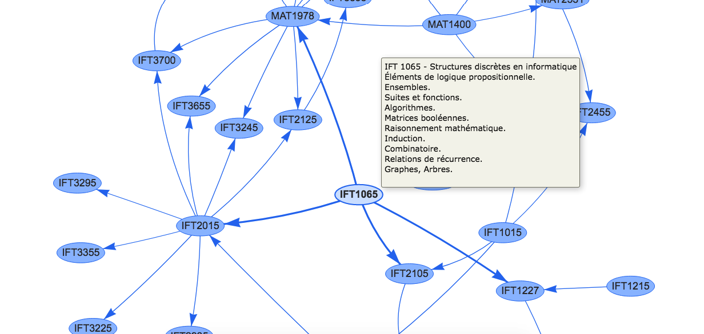

# Curriculum Map Data Extractor
 
 A Python script for extracting courses and their prerequisites from a curriculum at https://umontreal.ca ex: BSc in Computer Science, BSc in economic science and so on. The data is extracted locally and then transformed to output a .json file with select information (ex: prerequisite courses) that can be used to map out a network of all courses. 

 The main.py presents an example of how to use the program to get the data.
 
The program was made with extension in mind so it could be used as base for more universities than UdeM:

- Every code specific in extracting content from University of Montréal (UdeM) is located inside of the extractor_UdeM.py file.

- curriculum.py contains a Curriculum class which hold the information extracted.

Visualizations are made in the visjs library :

-[Bsc Computer Science (Informatique)](https://nassim-saboundji.github.io/UniversityCurriculumMaps/BScInformatique/)

  

-[Bsc Mathematics (Mathématique)](https://nassim-saboundji.github.io/UniversityCurriculumMaps/BScMath/)