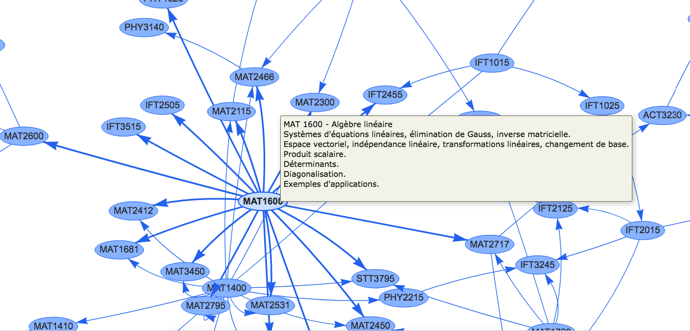
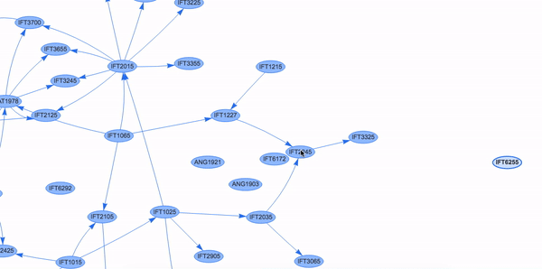

# University Curriculum Maps
Visualizations to help students select their courses. 

Some curriculums offer a lot of freedom in how you approach taking your courses. However, if you're not careful your progress could be slowed down because you didn't acquire the right prerequisites at the right time. Therefore, your graduation would be delayed. University Curriculum Map is a project that aims to help avoid this situation.

(Currently supports only University of Montréal)
## Curriculum Map Data Extractor
 
 A Python script for extracting courses and their prerequisites from a curriculum at https://admission.umontreal.ca ex: BSc in Computer Science, BSc in economic science and so on. The data is extracted locally and then transformed to output a .json file with select information (ex: prerequisite courses) that can be used to map out a network of all courses. 

 The main.py presents an example of how the extraction is done for the curriculum of the BSc in Computer Science at UdeM.
 
The program was made with extension in mind so it could be used as base for more universities than UdeM:

- Every code specific in extracting content from University of Montréal (UdeM) is located inside of the extractor_UdeM.py file.

- curriculum.py contains a Curriculum class which holds the information extracted.

Visualizations are made in the visjs library :

-[Bsc Computer Science (Informatique) visualization](https://nassim-saboundji.github.io/UniversityCurriculumMaps/BScInformatique/)

  

-[Bsc Mathematics (Mathématique) visualization](https://nassim-saboundji.github.io/UniversityCurriculumMaps/BScMath/)
  

## How to run?  
Running the data extractor:
 - install bs4 (BeautifulSoup) module by doing `pip3 install beautifulsoup4`

run `python3 main.py nameofdiscipline linkofthecurriculum`

`nameofdiscipline` must be all lower case with no space.

Ex: for physics it would be : https://admission.umontreal.ca/programmes/baccalaureat-en-physique/structure-du-programme/

Wait until the program finishes. It produced a `nameofdiscipline.json`
file.

Create a new folder. copy the index.html and makeCurriculumMap.js from ex: BScMath's folder and put them in the new one you just created.

Now replace `fetch("./math.json")` from makeCurriculumMap.js with 
`fetch("./nameofdiscipline.json")`

Now simply open the index.html file and you should see the map being 
generated.